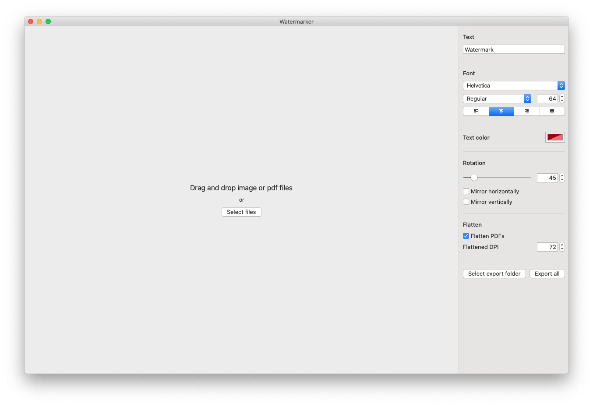
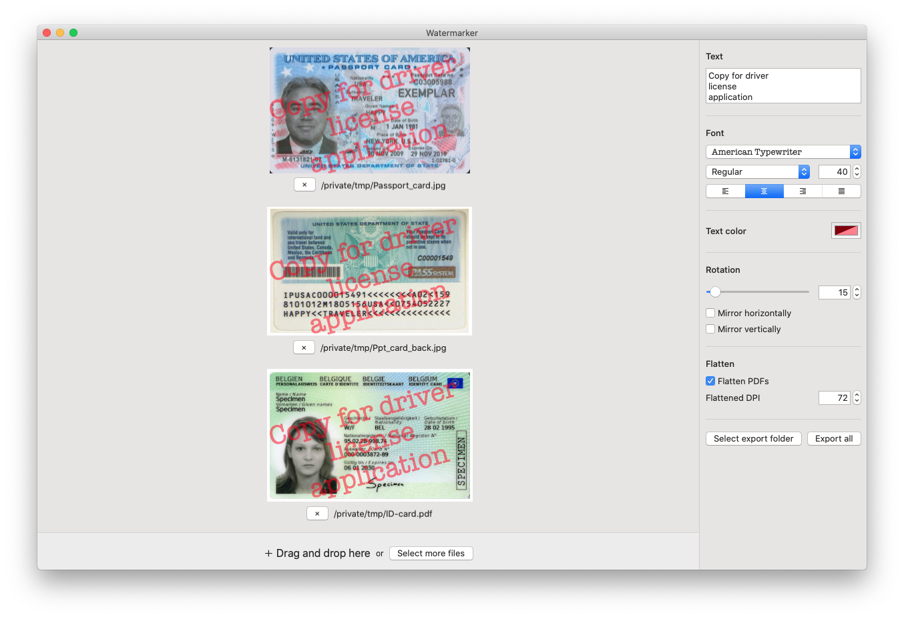

# Watermarker

Lightweight PDF &amp; image watermarker for macOS, built using [SwiftUI](https://developer.apple.com/xcode/swiftui)

## Preview

<table style="border: none">
  <tr style="border: none">
    <td style="border: none"></td>
    <td style="border: none"></td>
  </tr>
</table>

## Installing

Simply grab the latest version from the [release page](https://github.com/JRomainG/Watermarker/releases) (or click [here](https://github.com/JRomainG/Watermarker/releases/latest/download/Watermarker.app.zip)).

## Development

To install, simply checkout the `dev` branch of this repository:

```bash
git clone https://github.com/JRomainG/Watermarker.git
git checkout dev
```

You will then be able to open the `Watermarker.xcodeproj` project. Swift's package manager should automatically download [swift-collections.git](https://github.com/apple/swift-collections.git). Don't forget to change the team and signing certificate before building.

## Contributing

If you found a bug, or would like to see a new feature added, feel free to open an issue on the Github page. Pull requests are welcome!

## License

The project is available under the [GPLv3](https://www.gnu.org/licenses/gpl-3.0.en.html) license.
